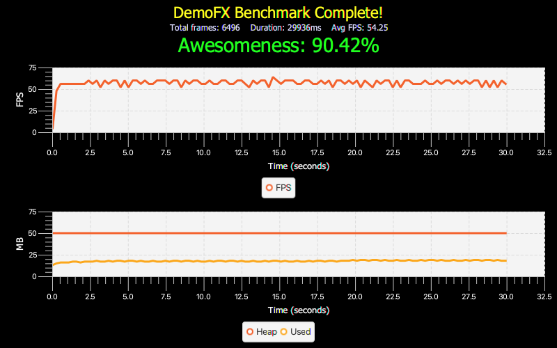
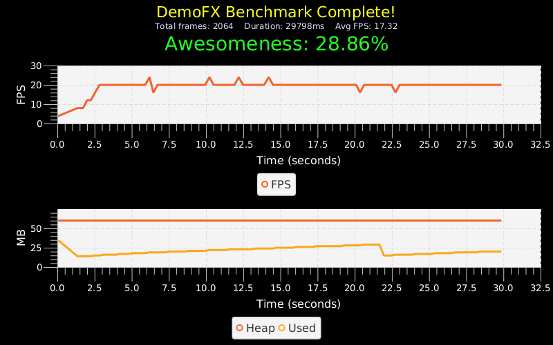
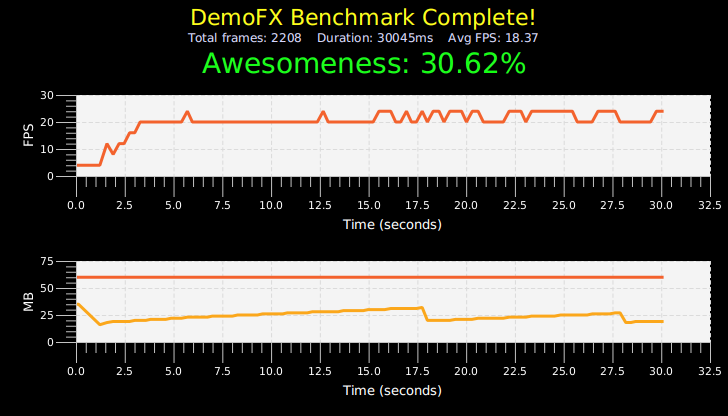

# DemoFX

Performance tests for JavaFX on HotSpot/Native Image, Desktop (Mac OS), Embedded (CLI with hw), Embedded (X with sw)

Same rumtime arguments for all cases: 

```
-e=colourbackground,triangles -c=1000 -t=30 -Xmx50m
```

Test


## Desktop

### HotSpot


Init time: 1378 ms

### Native Image



Init time: 469 ms

## Embedded (Pi 4)

### HotSpot 

#### No Window Manager, full screen



Init time: 4498 ms

#### Window Manager



Init time: 5157 ms

### Native Image

#### No Window Manager, full screen


Init time: 971 ms

#### Window Manager


Init time: 1932 ms